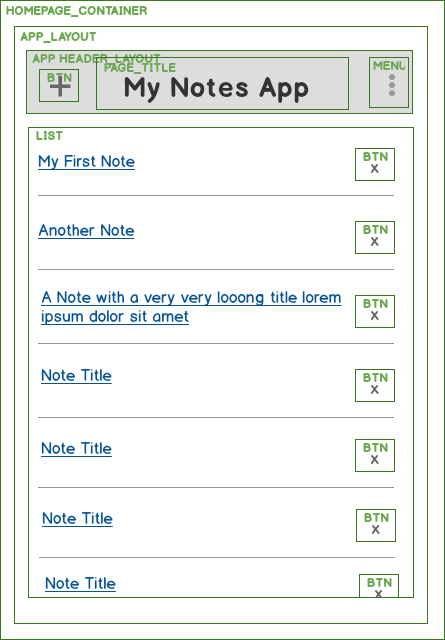

# Add an App Header

This component should only be responsible for layout.  However, we are also going to add a default page title, since that will be used in most cases when using this component.

## App Header Requirements

_reference back to the mockups - include mockup pic_


## Create the App Header Components

``` /imports/components/layouts/app_header_layout.jsx ```

```js
import React from 'react'
import { PageTitle } from '../content/page_title'


export const AppHeaderLayout = (props) => {

	return <nav className="navbar navbar-default">
	  <div className="container">
	    <div className="navbar-header">
	      {props.headerCenter}
	    </div>
	 </div>
	</nav>

}

AppHeaderLayout.propTypes = {
  headerCenter: React.PropTypes.object
}
```

- What are props, propTypes, and defaultProps?


## Add the PageTitle Component

``` /imports/components/content/page_title.jsx ```

```js
import React from 'react'

export const PageTitle = (props) => <h1 className="navbar-brand">{props.pageTitle}</h1>

PageTitle.propTypes = {
	pageTitle: React.PropTypes.string.isRequired
}
```


## Add the App Header to Homepage

``` /imports/components/pages/homepage.jsx ```

```js
...
import { AppHeaderLayout } from '../layouts/app_header_layout'
import { PageTitle } from '../content/page_title'

export const Homepage = () => {
	const 
	  appName = "My Notes App",
	  pageTitle = <PageTitle title={appName} />
      
	return  <div id="app-container">
              <AppHeaderLayout headerCenter={pageTitle} />
            <div id="main-content" className="container">
              Main content
            </div>
          </div>
}
```

We are adding the AppHeader only to the homepage because we will want to be able to pass in different data into this and other components depending on the page being viewed.

You should now see the app header appear in the browser.


